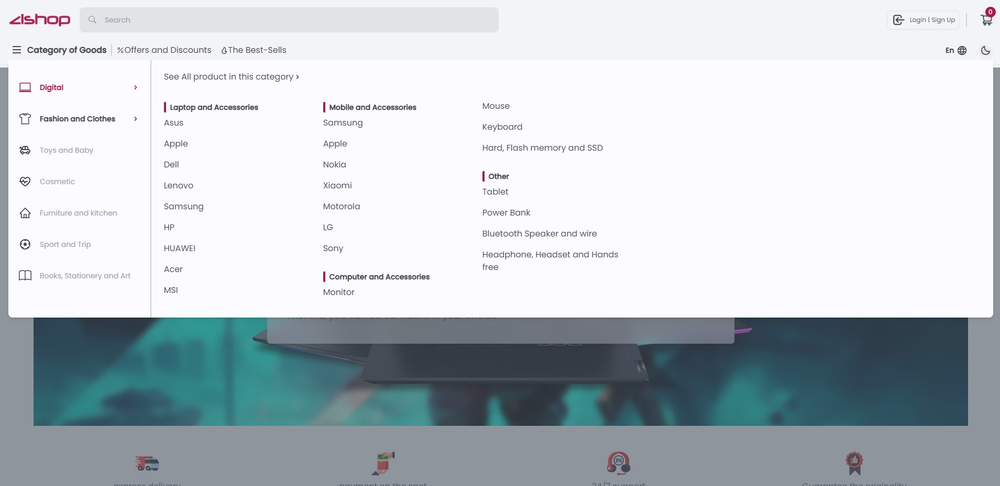

# Learn HTML/CSS the RightWay by practice

#### CSS and HTML aren't difficult, but they're not easy either!

It seems our focus is too much on less important parts of our career, such as learning `redux`, `recoil`, `jotai`, `remix`, etc. It's like learning endless amounts of stuff every day, but we're stuck at HTML, especially CSS, in the first place.

In other words, these tools are like spices that make no sense without the main meal, which is HTML/CSS/Javascript. Let's say we have the best ingredients, but we don't know how to cook well, so what will the outcome be?😅

In my experience, un-maintainable projects are often caused by HTML/CSS decisions due to underestimating HTML/CSS, In addition to JavaScript and React.

Let's practice the repetitive sections of a web page together to learn it better:

- Menu - Navigation bar - Mega menu
- Hero Section
- Search bars
- Form inputs
- Footers
- etc.

Our goal is to learn step-by-step how to create an enterprise-level online store together, like one of my students [ZI-SHOP](https://github.com/ZahraMirzaei/online-shop)

Here, we will implement simple, medium, and complicated ones.

Please feel free to contribute.
